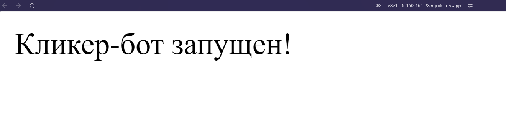

# Rust Clicker
Telegram clicker project inside of the mini app

## How to run

#### touch the `.env` file with data:

```bash
# TG Bot token
TELEGRAM_BOT_TOKEN=8788883892:A8iijk-887u8vjm-88JfjiujfjKFuujjolO
# Web-app's URL
URL=https://rust-clicker.ru/
```

For Dev mode use [Ngrok](https://ngrok.com/download) to redirect localhost to public URL
```bash
ngrok http 3030
```



#### Run the app

```bash
cargo r
```

